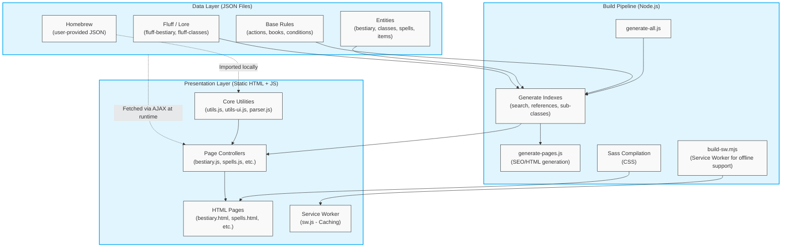

# 5etools-src Architecture

```mermaid
flowchart TB
    subgraph DataLayer ["Data Layer (JSON Files)"]
        direction TB
        BaseRules["Base Rules\n(actions, books, conditions)"]
        Entities["Entities\n(bestiary, classes, spells, items)"]
        Fluff["Fluff / Lore\n(fluff-bestiary, fluff-classes)"]
        Homebrew["Homebrew\n(user-provided JSON)"]
    end

    subgraph BuildPipeline ["Build Pipeline (Node.js)"]
        direction TB
        GenAll["generate-all.js"]
        GenIndexes["Generate Indexes\n(search, references, sub-classes)"]
        GenPages["generate-pages.js\n(SEO/HTML generation)"]
        BuildSW["build-sw.mjs\n(Service Worker for offline support)"]
        BuildCSS["Sass Compilation\n(CSS)"]

        GenAll --> GenIndexes
        GenIndexes --> GenPages
    end

    subgraph PresentationLayer ["Presentation Layer (Static HTML + JS)"]
        direction TB
        HTMLPages["HTML Pages\n(bestiary.html, spells.html, etc.)"]
        JSControllers["Page Controllers\n(bestiary.js, spells.js, etc.)"]
        CoreJS["Core Utilities\n(utils.js, utils-ui.js, parser.js)"]
        ServiceWorker["Service Worker\n(sw.js - Caching)"]
    end

    %% Relationships
    BaseRules --> GenIndexes
    Entities --> GenIndexes
    Fluff --> GenIndexes

    GenIndexes --> JSControllers
    BuildSW --> ServiceWorker
    BuildCSS --> HTMLPages

    DataLayer -. "Fetched via AJAX at runtime" .-> JSControllers
    Homebrew -. "Imported locally" .-> CoreJS

    JSControllers --> HTMLPages
    CoreJS --> JSControllers

    classDef default fill:#f9f9f9,stroke:#333,stroke-width:1px;
    classDef highlight fill:#e1f5fe,stroke:#03a9f4,stroke-width:2px;
    class DataLayer,BuildPipeline,PresentationLayer highlight;
```
