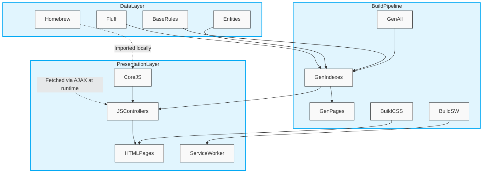

# 5etools-src Architecture

```mermaid
flowchart TB
    subgraph DataLayer
        direction TB
        BaseRules
        Entities
        Fluff
        Homebrew
    end

    subgraph BuildPipeline
        direction TB
        GenAll
        GenIndexes
        GenPages
        BuildSW
        BuildCSS

        GenAll --> GenIndexes
        GenIndexes --> GenPages
    end

    subgraph PresentationLayer
        direction TB
        HTMLPages
        JSControllers
        CoreJS
        ServiceWorker
    end

    %% Relationships
    BaseRules --> GenIndexes
    Entities --> GenIndexes
    Fluff --> GenIndexes

    GenIndexes --> JSControllers
    BuildSW --> ServiceWorker
    BuildCSS --> HTMLPages

    DataLayer -. "Fetched via AJAX at runtime" .-> JSControllers
    Homebrew -. "Imported locally" .-> CoreJS

    JSControllers --> HTMLPages
    CoreJS --> JSControllers

    classDef default fill:#f9f9f9,stroke:#333,stroke-width:1px;
    classDef highlight fill:#e1f5fe,stroke:#03a9f4,stroke-width:2px;
    class DataLayer,BuildPipeline,PresentationLayer highlight;
```